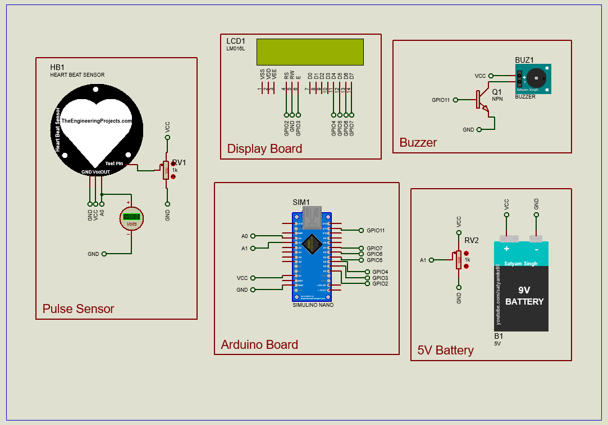

# 💓 P.A.M.O.C: Panic Attack Monitor and Control 
  

  
## 📖  Overview
 Pamoc is an Arduino Nano-based project that monitors your heart rate and suggests breathing exercises when it detects a potential panic attack. If your BPM (beats per minute) goes beyond a set threshold, Pamoc jumps into action, offering calming exercises to help you regain control.

## 🛠️ Components 

- **Arduino Nano**: The brain of the operation.
- **Pulse Sensor**: Measures the user's heart rate.
- **LCD Screen**: Displays BPM and breathing exercises.
- **Buzzer**: Provides audio alerts.
- **Battery**: Powers the system for portability.

## 🖥️ Running the Simulation 
1. Ensure you have Proteus 8 installed.
2. Open the provided .pdsprj file in Proteus.
3. Load the .hex file in the Arduino nano microcontroller.
4. Press start and see the simulation running on your screen.

## 🗺️ Roadmad
- [X] Proteus 8 simulation with Arduino Nano.
- [ ] Proteus 8 simulation with ESP32.
- [ ] Implementations using actual boards.
- [ ] Mobile app for real-time data analysis and reports.

## 👥 Authors

- 

## 🤝 Contributing

  Contributions are welcome! Feel free to submit pull requests or open issues if you encounter any problems.

## 📜 License

  This project is licensed under the MIT License - see the [LICENSE](LICENSE) file for details.
